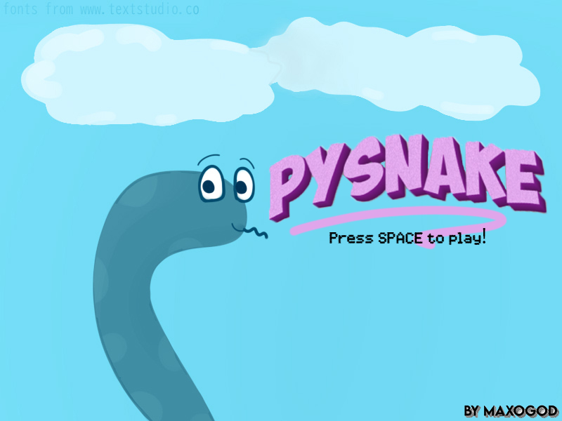
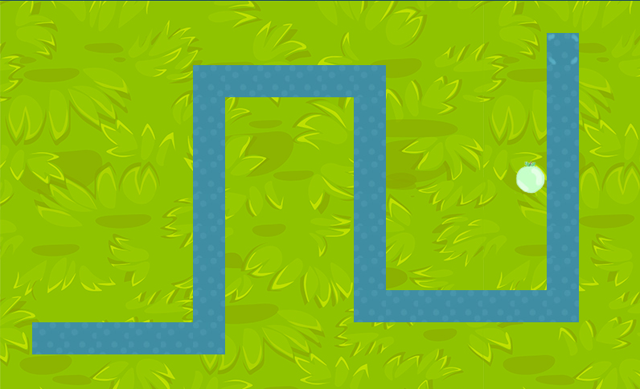
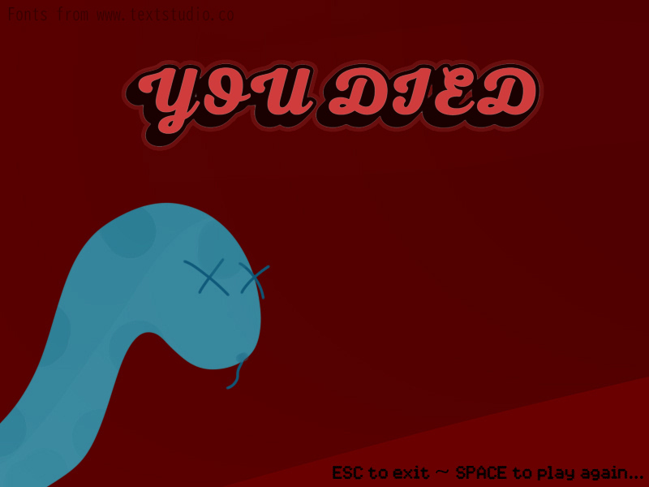

# Pysnake by maxogod
(it's a regular snake game made all by myself)
Run main.py to play! Have fun!

You can also convert it into an exe file using auto-py-to-exe.
Feel free to check out my other repositories, and collaborate if you wish to.

  
  
  

~~~
Bugs and cool implementations that i don't have the time to fix/make:
- Apple randomly changes pos, but it can appear on the snake's body (it shouldn't).
- Ask for player name if they got a new highscore, store it in a leaderboard and display it when TAB is pressed.
- Make 2 diferent difficulties, a fast one and a slower one.
- Choose your snake and background.
- Easteregg sounds and background changes when the player reaches a certain score.
- Pause/Resume buttons, and give 3 secs after resume is pressed.
~~~
/ grass background texture from https://www.freepik.com/author/babysofja /
